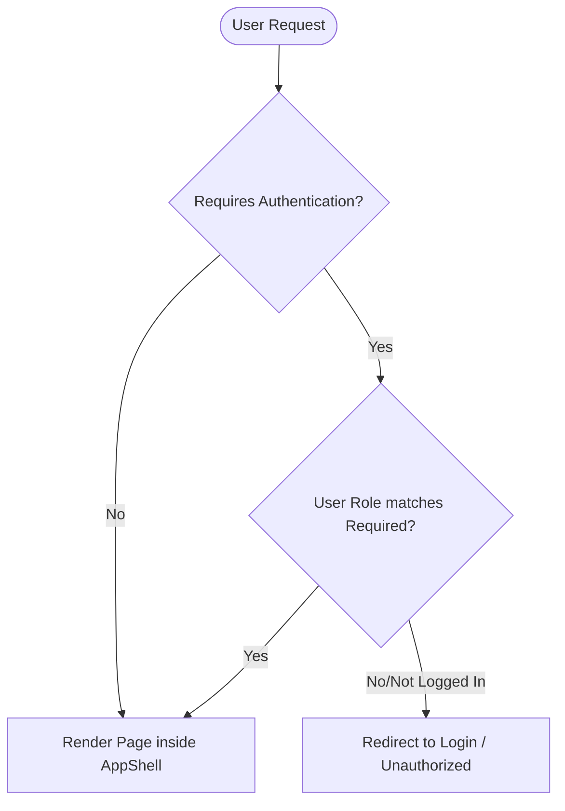

# LurnStack — Architectural & Theoretical System Documentation

This document provides a comprehensive architectural and theoretical overview of the **LurnStack** educational platform frontend application. It details the project organization, state management, routing design, layout shell, and component architecture.

---

## 1. 📖 Executive Overview
**LurnStack** is a full-featured, responsive online learning management system (LMS) and e-learning platform. The application is designed to support three distinct user roles:
*   **Students**: Browse courses, purchase programs, attend live classes, view certificates, and track attendance.
*   **Trainers**: Review class schedules and generate attendance/performance reports.
*   **Admins**: Oversee global system attendance records and course configurations.

The codebase is designed using a **modular, domain-driven structure**, grouping pages, components, API clients, slices, and contexts directly under their respective business domains (such as `auth`, `cart`, `live-classes`, or `attendance`).

---

## 2. 🛠️ Technology Stack
*   **Framework**: React (v19)
*   **State Management**: 
    *   **Global Redux State**: Redux Toolkit (v2) for asynchronous state management in complex domains (e.g., live classes scheduling).
    *   **React Context API**: Lightweight local state providers for user authentication (`AuthProvider`) and checkout/shopping cart updates (`CartProvider`).
*   **Routing**: React Router DOM (v6) with path declarations.
*   **Animations**: Framer Motion for smooth UI transitions and interactive cards.
*   **Styling**: Tailwind CSS (v3) for utility-first layout styling.
*   **Build System**: Create React App config (`react-scripts` v5).

---

## 3. 📂 Module & Domain Schema
Unlike monolithic structures that separate all pages from components globally, LurnStack distributes logic into self-contained domain folders under `src/`:

```
lurn-stack/
├── docs/                          # Project documentation files
├── public/                        # Static assets, favicon, and sitemaps
└── src/
    ├── App.js                     # Root component (combining providers and routing)
    ├── index.js                   # Application bootstrap entry point
    ├── index.css                  # Tailwind imports and global style adjustments
    ├── app/                       # Global core application configurations
    │   ├── AppShell.jsx           # Master layout wrapper with navbar, footer, widgets
    │   ├── providers/             # Global provider wrapper (Redux, Auth, Cart)
    │   ├── router/                # Router configurations and path matching variables
    │   └── store/                 # Redux Toolkit global store configuration
    ├── auth/                      # Authentication domain (Login, Signup, User Session)
    ├── cart/                      # Cart and checkout modules
    ├── attendance/                # Student, Trainer, and Admin attendance reports
    ├── live-classes/              # Live class listing, schedule calculations, detail pages
    ├── courses/                   # Course catalogue, detail outlines, curriculum sheets
    ├── my-learning/               # Student dashboards, certifications, and verification
    ├── seo/                       # Search Engine Optimization landing pages (e.g., Chennai local)
    ├── ai-chat/                   # Integrated helper chat widgets
    ├── integrations/              # External tracking scripts (e.g. Zoho SalesIQ)
    ├── sections/                  # Segmented landing sections used on the main portal
    └── shared/                    # Reusable buttons, forms, and loaders
```

---

## 4. 🎛️ State Management Architecture

### 4.1 Global Redux Store ([store.js](file:///b:/Tamil%20Info/lurn-stack/src/app/store/store.js))
The global Redux store handles heavy asynchronous states that need to remain synced across pages.
*   **Live Classes Slice** ([liveClassesSlice.js](file:///b:/Tamil%20Info/lurn-stack/src/live-classes/model/liveClassesSlice.js)):
    *   `fetchDashboardData`: Resolves upcoming and completed live classes based on scheduling timestamps relative to the user's local timezone.
    *   `joinLiveClass`: Registers student participation, tracks arrival timestamps, and outputs the dynamic virtual meeting URL.
    *   `fetchLiveClassDetails`: Retrieves specific information about an individual virtual class room.

### 4.2 Auth Domain Context (`AuthContext.jsx`)
Coordinates identity tokens, credentials cache, and session roles:
*   Maintains state for the currently logged-in user and their active role (`student`, `trainer`, or `admin`).
*   Integrates with `RequireAuth` component to dynamically redirect unauthorized users to the login route or show custom restricted-access layout notices.

### 4.3 Cart Domain Context (`CartContext.jsx`)
Manages item selection, pricing models, and coupon application:
*   Caches select course IDs in localized storage to prevent data loss on page reloads.
*   Triggers fly-out visual animations when courses are added to the bag.

---

## 5. 🎚️ Master Layout Shell ([AppShell.jsx](file:///b:/Tamil%20Info/lurn-stack/src/app/AppShell.jsx))
Every route loaded inside the main page router is rendered within `AppShell`, which manages the overall application shell:
*   **ScrollToTop**: Hook that automatically scrolls the browser window to top coordinates `(0, 0)` on every route transition.
*   **Integrations**:
    *   **Zoho SalesIQ**: Global client support widget loaded asynchronously.
    *   **DraggableWhatsApp**: Float element allowing mobile users to slide the chat icon vertically along the screen margin while preventing accidental taps.
    *   **CartFlyAnimator**: Captures canvas events to display an item flying toward the shopping cart bag.
    *   **AiChatWidget**: Custom conversational support interface powered by internal AI backend routes.

---

## 6. 🧭 Navigation & Access Control Routing

All path descriptors are centralized in [paths.js](file:///b:/Tamil%20Info/lurn-stack/src/app/router/paths.js), making it simple to restructure URLs. Access controls are implemented in the routing matrix ([router.jsx](file:///b:/Tamil%20Info/lurn-stack/src/app/router/router.jsx)):



### Route Highlights:
*   **Role-Restricted Paths**: `/live-classes`, `/attendance`, and `/checkout` require the active role to be `student`. `/trainer/attendance` requires `trainer`, while `/admin/attendance` is restricted to `admin` profiles.
*   **SEO Localized Paths**: Dynamic parameter slugs such as `/:locationSlug` route visitors to localized landing pages (e.g., `/software-courses-in-chennai`) mapping to dedicated search terms.
